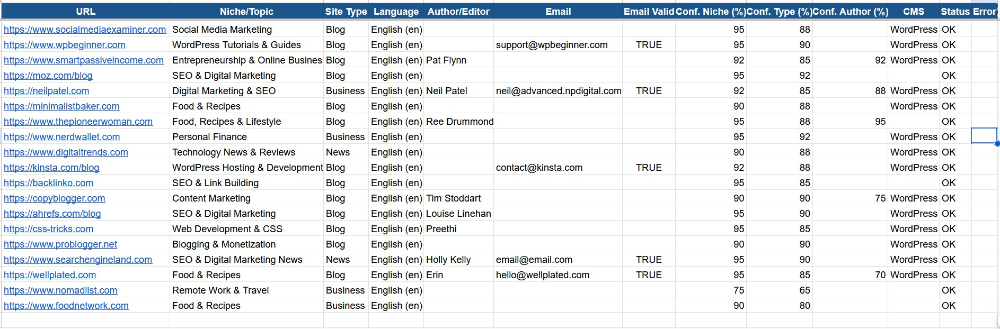

# 🔍 Bulk Website Analyzer

> Classify 500–1,000+ websites at scale using AI. Feed it a CSV of URLs (or let it discover them automatically), and get back niche, site type, language, author, and contact email — exported to CSV or Google Sheets.


---

## What It Does

| Field | Example Output |
|---|---|
| Niche / Topic | `Personal Finance` |
| Site Type | `Blog` / `News` / `Business` / `E-commerce` |
| Language | `English (en)` |
| Author / Editor | `Pat Flynn` |
| Contact Email | `neil@advanced.npdigital.com` |
| Email Valid | `True` (DNS MX verified) |
| Confidence Scores | `95% niche · 92% type · 88% author` |
| CMS Detected | `WordPress` / `Shopify` / `Ghost` |

---

## Demo

Real run across 20 diverse sites — authors detected, emails validated, all columns populated and auto-resized in Google Sheets:



---

## Quick Start

**Prerequisites:** Python 3.10+, an [Anthropic API key](https://console.anthropic.com)

```bash
# 1. Clone the repo
git clone https://github.com/zhuff99/BulkWebsiteAnalyzer.git
cd BulkWebsiteAnalyzer

# 2. Install core dependencies
pip install -r requirements.txt

# 3. Install Phase 2 extras
pip install playwright dnspython gspread google-auth
python -m playwright install chromium

# 4. Configure
cp .env.example .env
# Edit .env — add your ANTHROPIC_API_KEY at minimum

# 5. Run on the sample CSV
python analyzer.py --input sample_data/sites.csv
```

Results land in a timestamped CSV under `results/`. That's it.

---

## Installation

### Core (required)
```bash
pip install -r requirements.txt
```

### Playwright — JS rendering & anti-bot bypass
```bash
pip install playwright
python -m playwright install chromium
```

### Email DNS validation
```bash
pip install dnspython
```

### Google Sheets export
```bash
pip install gspread google-auth
```

---

## Usage

### Analyse a CSV of URLs
```bash
python analyzer.py --input sites.csv
```

### Auto-discover URLs by keyword (no CSV needed)
```bash
python analyzer.py --discover "personal finance blog" --discover-count 50
```

### Discover + validate emails + export to Google Sheets
```bash
python analyzer.py \
  --input sites.csv \
  --validate-emails \
  --sheets --sheets-name "My Research"
```

### Full-featured run
```bash
python analyzer.py \
  --input sites.csv \
  --discover "SEO tools" --discover-count 30 \
  --validate-emails \
  --sheets --sheets-name "SEO Tools Analysis" \
  --model claude-sonnet-4-6 \
  --workers 30
```

---

## All CLI Options

```
Input / Output:
  --input  CSV_FILE        Input CSV with a 'url' column
  --output CSV_FILE        Output path (default: results/results_TIMESTAMP.csv)

AI Settings:
  --model  MODEL_ID        Claude model (default: claude-haiku-4-5-20251001)
  --batch-size N           Sites per API call (default: 10)

Performance:
  --workers N              Concurrent fetch workers (default: 20)

Phase 2 Features:
  --validate-emails        DNS MX validation on all extracted emails
  --sheets                 Push results to Google Sheets
  --sheets-name NAME       Spreadsheet name (default: 'Bulk Website Analysis')
  --discover QUERY         Keyword query for URL auto-discovery
  --discover-provider      duckduckgo | serpapi | google_cse | commoncrawl
  --discover-count N       URLs to discover (default: 50)

Utility:
  --dry-run                Validate input without fetching
  --verbose                Debug-level logging
```

---

## Configuration

Copy `.env.example` to `.env` and fill in your values:

```env
# Required
ANTHROPIC_API_KEY=your_key_here

# Model selection (haiku = cheap & fast, sonnet = most accurate)
CLAUDE_MODEL=claude-haiku-4-5-20251001

# Performance tuning
MAX_WORKERS=20
REQUEST_TIMEOUT=15
PER_DOMAIN_DELAY=2.0
CLAUDE_BATCH_SIZE=10
BODY_TEXT_LIMIT=3000

# Phase 2: Google Sheets export (optional)
GOOGLE_SERVICE_ACCOUNT_FILE=path/to/service_account.json
SHARE_SHEET_WITH=you@gmail.com   # auto-shares new sheets to your Drive

# Phase 2: URL discovery (optional — DuckDuckGo is free, no key needed)
SERPAPI_KEY=
GOOGLE_CSE_KEY=
GOOGLE_CSE_ID=
```

### Google Sheets Setup (one-time)

1. Go to [console.cloud.google.com](https://console.cloud.google.com) and create a project
2. Enable **Google Sheets API** and **Google Drive API**
3. Go to **IAM & Admin → Service Accounts → Create Service Account**
4. Under **Keys → Add Key → JSON**, download the key file
5. Set `GOOGLE_SERVICE_ACCOUNT_FILE` in `.env` to point to that file
6. Set `SHARE_SHEET_WITH` to your personal Gmail
7. Create a blank Google Sheet, share it (Editor) with the service account email
8. Run with `--sheets --sheets-name "Your Sheet Name"`

---

## Cost Estimate

Using Claude Haiku (default):

| Sites | API Calls | Approx. Cost |
|---|---|---|
| 100 | 10 | ~$0.03 |
| 500 | 50 | ~$0.15 |
| 1,000 | 100 | ~$0.30 |

Switch to `--model claude-sonnet-4-6` for higher accuracy (~10× cost).

---

## How It Works

```
URLs (CSV or --discover keyword search)
        ↓
  Async HTTP Fetcher (httpx, 20 concurrent workers)
        ↓  ← auto-falls back on 403 / JS-heavy pages
  Playwright Headless Chromium
        ↓
  HTML Extraction
  ├── Title, meta description, body text
  ├── Email addresses (regex + contact page crawl)
  ├── Author name (JSON-LD, Open Graph, bylines)
  └── CMS fingerprint (WordPress, Shopify, Ghost…)
        ↓
  Claude AI — batched 10 sites per API call
  ├── Niche / topic classification
  ├── Site type (Blog / News / Business / E-commerce…)
  ├── Language detection
  └── Confidence scores (0–100)
        ↓
  Email DNS Validation (dnspython MX lookup)
        ↓
  CSV output  +  Google Sheets export (auto-resize, frozen header)
```

Full architecture diagram: [`website_analyzer_architecture.mermaid`](website_analyzer_architecture.mermaid)

---

## Project Structure

```
BulkWebsiteAnalyzer/
├── analyzer.py                       # CLI entry point
├── orchestrator.py                   # Async pipeline engine
├── models.py                         # Pydantic data schemas
├── config.py                         # Settings & .env loader
│
├── input/
│   ├── csv_loader.py                 # CSV parsing & URL validation
│   └── discovery.py                  # DuckDuckGo / SerpAPI / Common Crawl
│
├── fetcher/
│   ├── http_fetcher.py               # Async httpx with retry & rate limiting
│   └── playwright_fetcher.py         # Headless Chromium fallback
│
├── extractor/
│   ├── html_parser.py                # Title, body text, CMS detection
│   ├── email_extractor.py            # Email scraping
│   └── author_parser.py             # Author name extraction
│
├── ai/
│   ├── prompt_builder.py             # Claude prompt construction
│   └── claude_client.py             # Batched API calls with retry
│
├── validation/
│   └── email_validator.py            # Regex + DNS MX + optional SMTP
│
├── output/
│   ├── csv_writer.py                 # Timestamped CSV export
│   └── sheets_writer.py             # Google Sheets push with formatting
│
├── sample_data/
│   ├── sites.csv                     # 10 URLs — basic test
│   └── sites_with_contacts.csv       # 20 URLs — authors & emails demo
│
├── Screenshots/
│   └── google_sheets.jpg             # Demo output screenshot
│
├── requirements.txt
├── .env.example
└── website_analyzer_architecture.mermaid
```

---

## Input CSV Format

Minimum — just a `url` column:

```csv
url
https://www.example.com
https://www.another-site.com
```

The loader also accepts columns named `URL`, `website`, `domain`, or `link`. Extra columns are passed through to the output unchanged.

---

## Roadmap

- [x] **Phase 1** — CSV input, async HTTP fetching, Claude AI classification, CSV output
- [x] **Phase 2** — Playwright anti-bot fallback, email DNS validation, Google Sheets export with formatting, DuckDuckGo URL discovery
- [ ] **Phase 3** — Docker container for one-command deployment, Apify residential proxy integration for Cloudflare-protected sites
- [ ] **Phase 4** — Scheduled runs, database persistence, webhook / Zapier notifications

---

## Contributing

Pull requests welcome. For major changes please open an issue first.

1. Fork the repo
2. Create a feature branch (`git checkout -b feature/my-feature`)
3. Commit your changes
4. Open a pull request

---

## License

MIT
